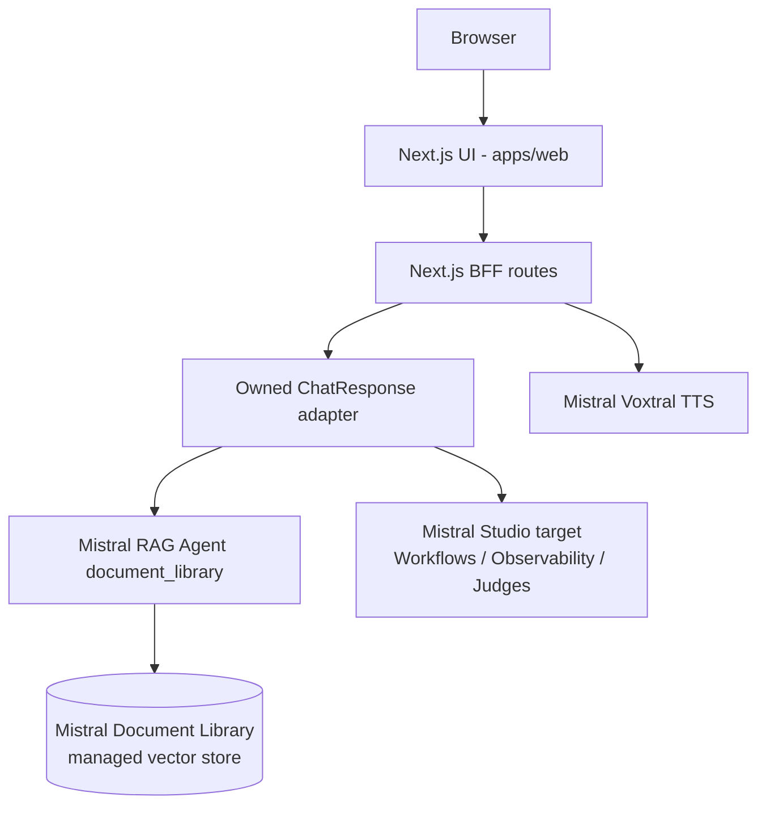

# Architecture

## Runtime view

The BFF does not expose Mistral credentials to the browser. It calls the
Mistral Conversations API server-side with the provisioned prevention Agent,
`store: false`, and an owned response contract. If Mistral Document Library is
unavailable, `/api/chat` and `/coach_bot` return an explicit unavailable state
instead of fabricating a local answer.

## Agent shape

The production MVP path is intentionally small and explicit:

1. validate and normalize the request in the Next.js BFF;
2. infer audience and deterministic risk signals;
3. call the Mistral Agent with the `document_library` tool;
4. normalize Mistral references into `/guide/<domain>?page=<n>` links;
5. return the stable `ChatResponse` contract.

`ChatResponse` separates product semantics from implementation diagnostics:
`status` and `grounding` describe whether the answer is source-grounded, while
`diagnostics.generation` and `diagnostics.retrieval` carry backend names for
technical review. The older `generationMode` and `retrieval.kind` fields remain
deprecated aliases for MVP compatibility.

The previous Python LangGraph graph remains in `services/agent` as reference
material while the strategic target moves to Mistral Workflows.

## RAG pipeline

The MVP uses Mistral Document Library via Mistral Agents API. Documentary
answers are Mistral-only: if the Mistral Library/Agent is missing or unavailable,
the BFF returns an explicit unavailable state instead of falling back to
OpenAI, a local lexical answer, Qdrant, Ragie or Pinecone.

Mistral Document Library is the managed vector store. Mistral owns parsing,
chunking, embeddings, vector search and raw references. The application owns
the public contract, trace IDs, fail-closed behavior, deterministic risk scoring
and normalization into the stable web citation contract.

File ingestion is separate from retrieval:

1. Source manifest defines allowed documents, public URLs, display titles and
   domain tags.
2. `scripts/mistral_library_admin.py` creates/reuses a Mistral Library.
3. The script uploads PDF/DOCX/PPTX/TXT files to the Library and can poll
   processing status.
4. The script creates/reuses a Mistral Agent with the `document_library` tool.
5. The BFF calls that single-purpose Mistral RAG Agent with `store=false`
   when supported and normalizes Mistral `tool_reference` / `reference` chunks
   into internal `/guide/<domain>?page=<n>` links.

Local corpus metadata remains useful only for stable titles, guide domains and
page links. It is not a fallback retriever.

This is close to a Mistral-native app such as `antoine-palazz/use-case-design`,
but the web contract, citation repair, product metadata and trace identifiers
remain owned by this application.

## Enterprise target trajectory

The demo is not deployed on AXA infrastructure. The intended enterprise
trajectory is:

- Azure API Management or equivalent gateway in front of BFF/agent services.
- Mistral or an AXA-approved model gateway for generation.
- Mistral Document Library or AXA-governed managed RAG for PDF retrieval.
- Mistral Workflows for durable multi-step processes once worker hosting and
  Studio entitlements are proven.
- OpenShift/Kubernetes for controlled runtime isolation.
- OAuth2/OIDC, managed identities and Key Vault for authentication/secrets.
- Mistral Studio Observability, Judges, Campaigns, Datasets and AI Registry as
  the default quality plane; OpenTelemetry/internal logs only where needed.
