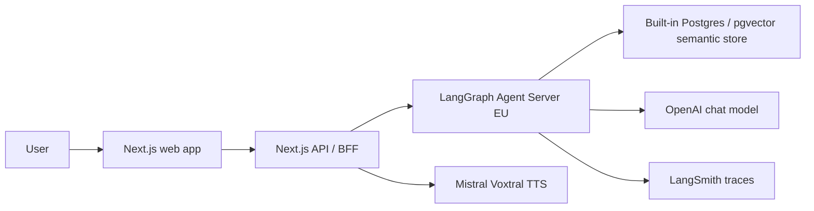

# AXA Prevention Coach POC

[](https://github.com/gfortaine/prevention-coach-rag/actions/workflows/ci.yml)

Independent interview prototype for an agentic prevention assistant: a Next.js
BFF and AXA-like UI connected to a Python LangGraph agent, semantic RAG,
LangSmith observability and Mistral Voxtral text-to-speech.

Live demo: <https://axa-prevention-coach.vercel.app>

> This POC is not affiliated with or endorsed by AXA. See the repository
> [NOTICE](../../NOTICE).

## What is implemented



- **Agentic orchestration:** LangGraph graph with intent, retrieval, risk,
  generation, compliance and BFF formatting nodes.
- **RAG:** LangSmith/LangGraph built-in Postgres + pgvector semantic store,
  seeded from LiteParse-normalized files.
- **BFF compatibility:** `/api/chat` and `/coach_bot` contracts for a web UI
  and reverse-engineered AXA-style surface.
- **Voice:** server-side Mistral Voxtral TTS streaming via `/api/tts/stream`.
- **Design system:** AXA France Canopée `prospect` tokens/components, with
  custom chat surfaces for fidelity to the public assistant behavior.
- **Observability:** LangSmith traces and lightweight FinOps/RSE metadata.

## Layout

```text
apps/web/          Next.js 16 / React 19 / TypeScript / AXA Canopée UI
services/agent/    Python LangGraph agent, LiteParse ingestion and seed script
docs/              Architecture, deployment, security, observability and ADRs
```

## Quick start

```bash
pnpm install
pnpm axa:web:dev
```

Agent development:

```bash
cd pocs/axa-prevention-coach/services/agent
uv sync --group dev
uv run langgraph dev --no-browser
```

Seed a running local Agent Server:

```bash
cd pocs/axa-prevention-coach/services/agent
LANGGRAPH_API_URL=http://127.0.0.1:2024 uv run python scripts/seed_store.py
```

Runtime retrieval is strict: if the semantic store is empty or unavailable, the
graph returns an explicit retrieval warning instead of using a local lexical
answer path.

## Quality gates

```bash
pnpm run lint
pnpm run typecheck
pnpm run test
pnpm run build
```

## Documentation

- [Architecture](docs/architecture.md)
- [Deployment](docs/deployment.md)
- [Security](docs/security.md)
- [Observability](docs/observability.md)
- [Design system](docs/design-system.md)
- [Roadmap](docs/roadmap.md)
- [ADRs](docs/adr/)
